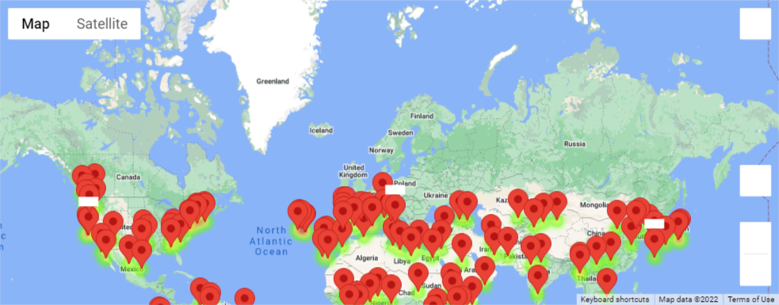
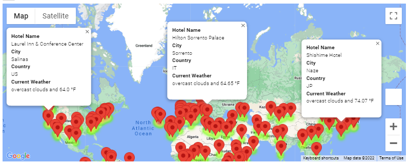
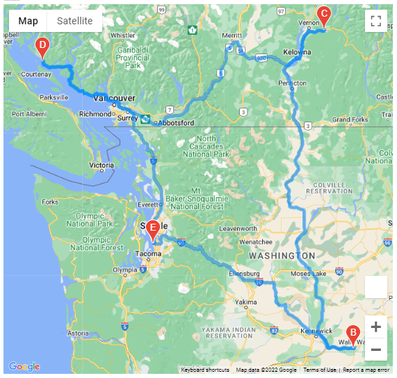
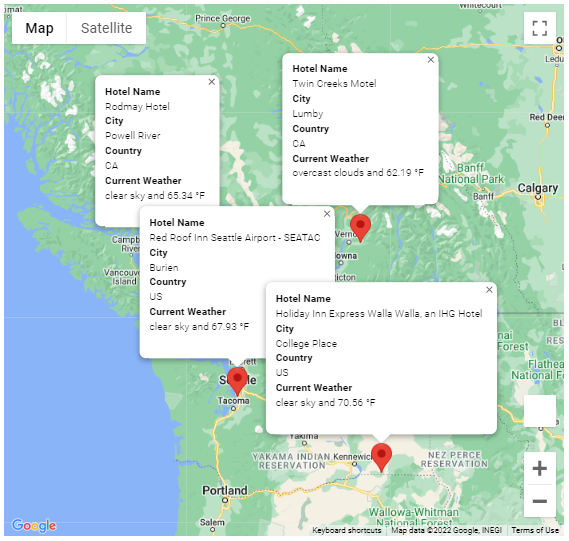

# World Weather Analysis
This project focused on honing our knowledge of Python, decision and repetition statements, data structures, Pandas, Matplotlib, SciPy statistics, gmaps, and the Application Programming Interface (API) concepts.

## Table of Contents
- [Overview of Project](#overview-of-project)
  - [Resources](#resources)
  - [Challenge Overview](#challenge-overview)
  - [GitHub Repo Branches](#github-repo-branches)
- [Implementation and Results](#implementation-and-results)
  - [Deliverable 1](#deliverable-1)
  - [Deliverable 2](#deliverable-2)
  - [Deliverable 3](#deliverable-3)
- [Summary](#summary)
- [References](#references)

## Overview of Project
Module 6 assignment fostered further understanding of Python coding concepts by leveraging an interactive computational environment, Jupyter Notebook, and many of its integrated useful modules, functions, and data structures to perform analysis and visualization of the world weather data for each city around the world more efficiently. We then applied some popular Python libraries, especially Pandas, NumPy, citipy, API requests and visualization using gmaps (Google maps) plugin, for crafting interactive travel destinations and itinerary maps, which were based on travelers' preferred criteria and had pop-up markers for each destination on the map. This report summarized how our methodology and results can be used by decision-makers at a hypothetical travel company, PlanMyTrip and our customers for choosing the best possible travel itineraries.

### Resources
- Input/output file: WeatherPy_Database.csv, WeatherPy_vacation.csv
- Source code: Weather_Database.ipynb, Vacation_Search.ipynb, Vacation_Itinerary.ipynb
- Image file: png files
- Software/library: [citipy](https://github.com/wingchen/citipy), [gmaps](https://jupyter-gmaps.readthedocs.io/en/latest/), [conda](https://github.com/conda/conda/releases), [Python 3.9](https://docs.python.org/release/3.9.12/), or their newer releases

### Challenge Overview
Our goal is to understand the API concepts through systematic steps that are commonly exercised when analyzing world weather based on coordinates and weather parameters of more than 600 cities around the world using Python, Pandas, citipy, OpenWeatherMap API, and Google Maps Platform. Outline of our deliverables and a written report for presenting our results:

- ☑️ Deliverable 1: Retrieve Weather Data.
- ☑️ Deliverable 2: Create a Customer Travel Destinations Map.
- ☑️ Deliverable 3: Create a Travel Itinerary Map.
- ☑️ Deliverable 4: A written report for the World Weather analysis (this ["README.md"](./README.md)).

### GitHub Repo Branches
All deliverables in Module 6 challenge are committed in this GitHub repo as outlined below.

main branch  
|&rarr; [./README.md](./README.md)  
|&rarr; [./WeatherPy.ipynb](./WeatherPy.ipynb)  
|&rarr; [./VacationPy.ipynb](./VacationPy.ipynb)  
|&rarr; ./Weather_Database/  
  &emsp; |&rarr; [./Weather_Database/Weather_Database.ipynb](./Weather_Database/Weather_Database.ipynb)  
  &emsp; |&rarr; [./Weather_Database/WeatherPy_Database.csv](./Weather_Database/WeatherPy_Database.csv)  
|&rarr; ./Vacation_Search/  
  &emsp; |&rarr; [./Vacation_Search/Vacation_Search.ipynb](./Vacation_Search/Vacation_Search.ipynb)  
  &emsp; |&rarr; [./Vacation_Search/WeatherPy_vacation.csv](./Vacation_Search/WeatherPy_vacation.csv)  
  &emsp; |&rarr; [./Vacation_Search/WeatherPy_vacation_map.png](./Vacation_Search/WeatherPy_vacation_map.png)  
  &emsp; |&rarr; [./Vacation_Search/WeatherPy_vacation_map_gmap.png](./Vacation_Search/WeatherPy_vacation_map_gmap.png)  
|&rarr; ./Vacation_Itinerary/  
  &emsp; |&rarr; [./Vacation_Itinerary/Vacation_Itinerary.ipynb](./Vacation_Itinerary/Vacation_Itinerary.ipynb)  
  &emsp; |&rarr; [./Vacation_Itinerary/WeatherPy_travel_map.png](./Vacation_Itinerary/WeatherPy_travel_map.png)  
  &emsp; |&rarr; [./Vacation_Itinerary/WeatherPy_travel_map_markers.png](./Vacation_Itinerary/WeatherPy_travel_map_markers.png)  
|&rarr; ./weather_data/  
  &emsp; |&rarr; [./weather_data/cities.csv](./weather_data/cities.csv)  
  &emsp; |&rarr; [./weather_data/Fig1.png](./weather_data/Fig1.png)  
  &emsp; |&rarr; [./weather_data/Fig2.png](./weather_data/Fig2.png)  
  &emsp; |&rarr; [./weather_data/Fig3.png](./weather_data/Fig3.png)  
  &emsp; |&rarr; [./weather_data/Fig4.png](./weather_data/Fig4.png)  

## Implementation and Results
During the full implementation phase, we ascertained all data generation, cleaning, and verification steps by using `df.to_csv()` (export DataFrame into a csv file), `pd.read_csv()` (import csv file as a DataFrame), `df.info()`, `df.dtypes`, `isna()` or `isnull()`, `notna()` or `notnull()`, and so on. We verified that our weather and vacation databases were clean and consisted of sufficient number of random cities. A few code refactoring approaches that might be unique when analyzing and visualizing the data are summarized below.

### Deliverable 1
- I imported the API key by using `dotenv` rather than `config.py` method, which seems to be more secure for collaborative development of real-world projects. The objective was for ensuring we are prepared for future collaborative projects and reducing the probability of exposing our config files accidentally. Below is an example of using `dotenv`.

```
# Import the API key by using dotenv instead of config.py
%load_ext dotenv
%dotenv
import os
api_key = os.getenv('API_KEY')
```

- Another code refactoring approach was to apply list comprehension technique that we learned during the in-person class and `pd.unique()` function to filter a list of all unique city names. This was equally efficient for looping through each unique city when building our Weather Database. Please refer to the code snippet below.

```
# Create a list for holding the cities by using list comprehension and unique()
cities = [citipy.nearest_city(coordinate[0], coordinate[1]).city_name for coordinate in coordinates]
cities = pd.unique(cities)
```

The refactored code and resulting database can be reviewed in [Weather_Database.ipynb](./Weather_Database/Weather_Database.ipynb) and [WeatherPy_Database.csv](./Weather_Database/WeatherPy_Database.csv).

### Deliverable 2
The customer's preferred minimum and maximum temperature criteria were defined as follows.
- What is the minimum temperature you would like for your trip? **60 &deg;F**
- What is the maximum temperature you would like for your trip? **75 &deg;F**

Because a few empty strings in the `hotel_df` DataFrame could not be dropped by `dropna()` function, I applied the following method to clean the DataFrame. I used Pandas' `isnull()` and `notnull()`, which map missing values and non-missing values to boolean True, respectively, so that I could then use `dropna()` to completely remove those rows where hotel names were missing or **NaN** after the replacement took place in this case.

```
# 7. Drop the rows where there is no Hotel Name.
clean_hotel_df = hotel_df[hotel_df.replace('', np.nan).notnull()].dropna(how='any')
```

I verified the number of empty hotel names that we successfully dropped by running:

```
print(hotel_df[hotel_df.replace('', np.nan).isnull()].count()['Hotel Name'], " empty rows were dropped.")
```

The refactored code, `clean_hotel_df` DataFrame data, and customer's travel destinations map can be reviewed in [Vacation_Search.ipynb](./Vacation_Search/Vacation_Search.ipynb), [WeatherPy_vacation.csv](./Vacation_Search/WeatherPy_vacation.csv), and Fig. 1-2. The little white rectangles on the map of Fig. 1 marked the three destinations that were clicked.

\
**Fig. 1 Travel destinations map**

\
**Fig. 2 Travel destinations map with pop-up markers for each destination**

### Deliverable 3
- Throughout this project, I mainly used `type()` for ensuring the class type of objects and variables met the requirements of each deliverable.

- Four DataFrames were created as below, one for each city on the itinerary.

```
vacation_start = vacation_df.loc[vacation_df['City'] == 'Burien']
vacation_end = vacation_start
vacation_stop1 = vacation_df.loc[vacation_df['City'] == 'College Place']
vacation_stop2 = vacation_df.loc[vacation_df['City'] == 'Lumby']
vacation_stop3 = vacation_df.loc[vacation_df['City'] == 'Powell River']
```

- The latitude and longitude pairs for each of the four cities were retrieved as tuples.

```
start = tuple(vacation_start.to_numpy()[0][5:7])
end = start
stop1 = tuple(vacation_stop1.to_numpy()[0][5:7])
stop2 = tuple(vacation_stop2.to_numpy()[0][5:7])
stop3 = tuple(vacation_stop3.to_numpy()[0][5:7])
```

- A directions layer map between the cities and the travel map was created and uploaded as `WeatherPy_travel_map.png`. To keep consistency, I used tuples instead of lists for storing the waypoints and travel_mode, and applied specific layout dimensions for better visibility.

```
waypoints = (stop1, stop2, stop3)
travelmode = ("DRIVING", "BICYCLING", "WALKING")
figure_layout = {'width': '700px', 'height': '700px', 'margin': '0 auto 0 auto'}
fig = gmaps.figure(layout=figure_layout)
start2end = gmaps.directions_layer(start, end, waypoints=waypoints, travel_mode=travelmode[0])
fig.add_layer(start2end)
fig
```

- A DataFrame that contains the four cities on the itinerary was created.

```
itinerary_df = pd.concat([vacation_start, vacation_stop1, vacation_stop2, vacation_stop3], ignore_index=True)
```

The refactored code, `itinerary_df` DataFrame data, and customer's travel itinerary map can be reviewed in [Vacation_Itinerary.ipynb](./Vacation_Itinerary/Vacation_Itinerary.ipynb) and Fig. 3-4.

\
**Fig. 3 Travel itinerary with directions layer map**

\
**Fig. 4 Travel itinerary map with pop-up markers for each destination**

## Summary
When accomplishing this project, I tried my best to strive for efficiency and readability. Efficiency was mostly achieved by applying some best practices through the use of early binding programming technique ([Python imports](https://peps.python.org/pep-0008/#imports)), efficient decision and repetition statements, code refactoring, and built-in functions. Doing so usually helps to keep my codes clean and hopefully more maintainable. Finally, I would like to extend my gratitude to our TAs, especially Kristina D'Alessio and Austin Sloane, for patiently sharing their expertise and insightful guidance.

## References
[Pandas User Guide](https://pandas.pydata.org/pandas-docs/stable/user_guide/index.html#user-guide)\
[Matplotlib Stable Release](https://matplotlib.org/3.6.0/users/release_notes.html)\
[python-dotenv](https://pypi.org/project/python-dotenv/)\
[series.unique vs list of set - performance](https://stackoverflow.com/questions/46839277/series-unique-vs-list-of-set-performance)\
[Drop rows containing empty cells from a pandas DataFrame](https://stackoverflow.com/questions/29314033/drop-rows-containing-empty-cells-from-a-pandas-dataframe)\
[gmaps documentation](https://jupyter-gmaps.readthedocs.io/en/latest/tutorial.html#directions-layer)\
[Should import statements always be at the top of a module?](https://stackoverflow.com/questions/128478/should-import-statements-always-be-at-the-top-of-a-module)\
[ISO 8601 Standard - date and time format](https://en.wikipedia.org/wiki/ISO_8601)
